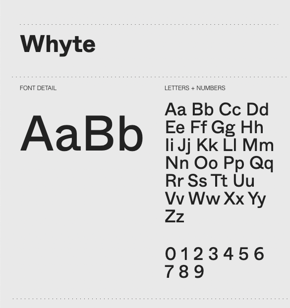
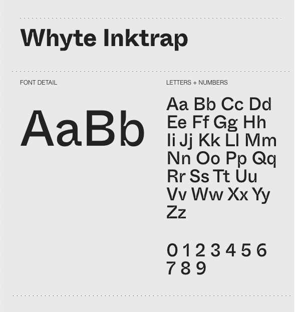
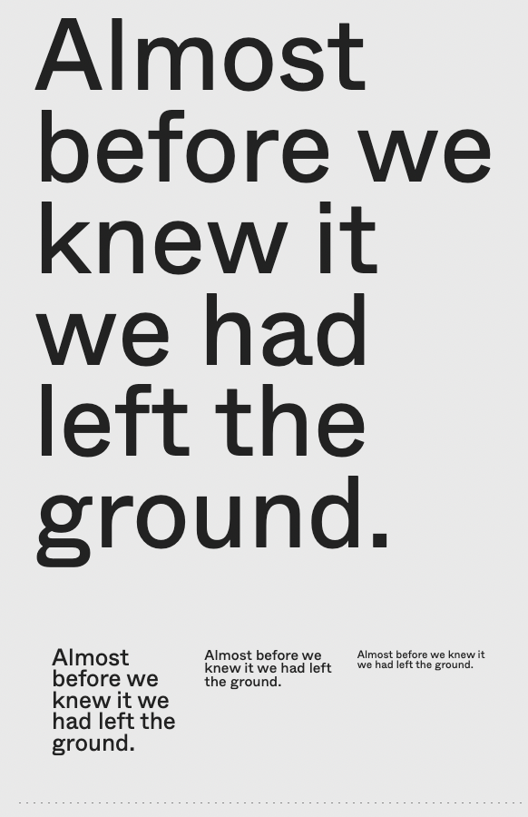
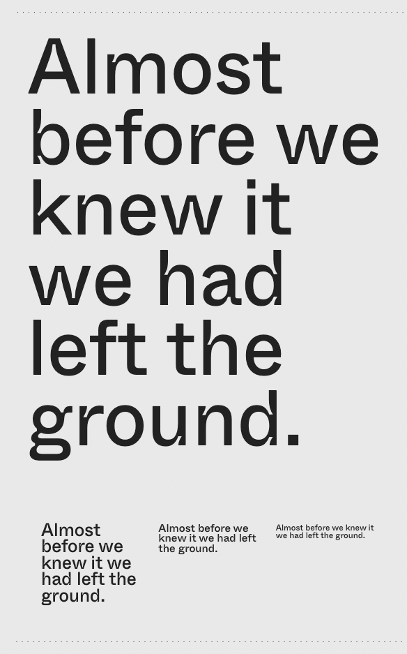

# Figma Merch Store 


This is a solution to the [Figma Merch Store](https://www.frontendpractice.com/projects/figma) challenge on [Frontend Practice](https://www.frontendpractice.com/). 


## 
View live demo of my solution <s>[here](https://soft-mermaid-23f7cd.netlify.app/)</s> 

View [store.figma.com](https://store.figma.com/)

##


## Table of contents

- [Overview](#overview)
  - [The challenge](#the-challenge)
  - [Demo](#demo)
  - [Screenshots](#screenshots)
- [Features](#features)
- [My process](#my-process)
  - [Built with](#built-with)
  - [Continued development](#continued-development)
  - [What I learned](#what-i-learned)
  - [Continued development](#continued-development)
  - [Useful resources](#useful-resources)
- [Author](#author)

## Overview

### The challenge

Code a replication of the [Figma Merch Store](https://store.figma.com/) site, from this [frontend-practice](https://www.frontendpractice.com/) [project](https://www.frontendpractice.com/projects/figma).

### Users should be able to:
- [x] Toggle the dropdown search bar by clicking the search icon, allowing them to conveniently search for products.
- [x] Filter the list of products by category.
- [ ] See hover states for all interactive elements on the page, 
  <!-- - [x] Product photo swap images on hover, 
  - [ ] Recreate the circle with rotating text and hover animation. -->
- [x] Utilize a draggable slider to effortlessly explore featured products within the hero section and also to view product thumbnails while using the mobile viewport
- [x] Add, remove, and update products to their shopping cart, ensuring a convenient shopping experience and enabling them to review their selections before finalizing a purchase
- [ ] Navigate through a smooth and streamlined checkout process, ensuring efficient completion of their purchase.
- [x] Select a country and have the currency automatically update, ensuring accurate pricing information aligned with their chosen location.
- [x] View and interact with all animated elements on the page
  <!-- - [ ] page elements apear on Scroll, etc -->
- [ ] View the optimal layout for each page depending on their device's screen size
  - [ ] Mobile: `< 900px`
  - [ ] Desktop: `> 900px`

### Demo
View live demo [here](https://soft-mermaid-23f7cd.netlify.app/)
<!--Solution URL:</b> [here](https://github.com/Chanda-Abdul/Angular-Multi-step-form) | <b>Live Site URL:</b> [here](https://dazzling-crisp-559db7.netlify.app/) -->
### Screenshots


## Features
### Animations
  - [Draggable Image Slider](#draggable-slider-using-gsap)
  - [Swap image on hover](#swap-image-on-hover)
  - [Marquee](#marquee-animation)
  - [Circle SVG with rotating text and hover animation](#circle-svg-with-rotating-text-and-hover-animation)
### Styling
  - [Custom Fonts](#custom-fonts)
  - [Dropdown Search](#dropdown-search-bar)
  - [Random color generation](#random-color-generation)
### Angular/JavaScript
  - [Custom Currency Pipe](#custom-currency-pipe)
  - [Content filtering](#content-filtering)
  - [Shopping Cart](#cart)
  - [User Reviews/Ratings (Bonus)](#user-reviewsratings-component)
  <!-- - [Size Chart (Bonus)](#) -->

## Draggable Slider using GSAP


- Created a custom <i>Angular </i>Structural **`@Directive`** to craft an interactive image slider with draggable functionality. The animation was created using **[GreenSock](https://greensock.com/)**'s `Draggable` feature.


- In the **`/hero`** component 

    


- In the **`/product`** component (mobile view)

    

- **`draggable-slider.directive.ts`**
  ```ts
    @Directive({
      selector: '[dragSliderDir]'
    })

    export class DraggableSliderDirective {
      draggable!: Draggable;

      constructor(private imagesRef: ElementRef) { }

      ngAfterViewInit() {
         gsap.registerPlugin(Draggable);
         this.initializeDragabbleSlider();
      }

      initializeDragabbleSlider() {
        let content = this.imagesRef.nativeElement;
        let slider = content.parentNode;

        this.draggable = new Draggable(content, {
          type: 'x',
          repeat: -1,
          edgeResistance: 2,
          dragResistance: .1,
          bounds: slider,
          paused: true,
          center: false,
          throwProps: true,
          snap: { x: [0, 100] }
        })
      }
    }

  ```
- **`hero.component.html`**
  ```html
    <div class="hero">
      <div class="container">
        <div class="draggable-images"
              dragSliderDir >
          <svg></svg>
          <svg></svg>
          <svg></svg>
          
          ...
          
        </div>
      </div>
      </div>

  ```
- **`product.component.html`**

  ```html
    ...

    <div class="product-grid__thumbnails">
        <div class="product-grid__thumbnails--mobile-drag"
                  dragSliderDir>
          <figure *ngFor="let photo of product.productPhotos; 
          let i = index">
              
          </figure>

        ...

      </div>
    </div>
    
  ```

<i>**If anyone knows how to make this draggable slider an infinite loop please let me know**</i>

## Swap image on hover

 

- In the **`/product-list`** component, a custom **`@Directive`** was created to swap **`/product-card`**'s default cover image to a pattern/image on **`:hover`**, using <i>CSS animations</i>, opacity and positioning.

    

- **`hover-img-swap.directive.ts`**
  ```ts
      @Directive({
        selector: '[hoverImgSwap]',
      })

      export class HoverImgSwapDirective {

        @HostBinding('class.hoverImgSwap')
        get cssClasses() {
          return true;
        }
      }
  ```
- **`product-card.component.html`**
  ```html
    <div class="product-list__product" hoverImgSwap>

        <figure>

          

          

          

        </figure>

        ...

    </div>
  ```
- in **`_animations.scss`**

  ```scss
    .hoverImgSwap {

      figure {
        position: relative;
        border-radius: $border-radius-default;
        border: none;

        img {
          transition: border-color 750ms, opacity 750ms;
          border-radius: $border-radius-default;
          width: 100%;
          height: 100%;
          top: 0;
          left: 0;
          right: 0;
          bottom: 0;
          object-fit: cover;
        }

        :first-child,
        :nth-child(2) {
          position: absolute;
          border: $border-default;
          opacity: 0;
        }

        :nth-child(3) {
          position: absolute;
          opacity: 1;
        }
      }

      &:hover {
        figure {
          :first-child {
            opacity: 1;
            width: 100%;
            height: 100%;
          }
        }

        :nth-child(2) {
          opacity: 1;
          max-width: 100%;
          max-height: 100%;
          z-index: 2;
        }

        :nth-child(3) {
          opacity: 0;
        }
      }
    }
  ```
 ## Marquee Animation

 

- In the **`/footer`**  component, I created a custom re-useable, <i>Angular </i>Structural **`@Directive`**, to craft a scrolling **`<marquee>`**  animation featuring both text and **`<svg>`** elements. This animation was achieved using **[GreenSock](https://greensock.com/)** for seamless and dynamic motion.


- **`marquee.directive.ts`**
  ```ts
    @Directive({
    selector: '[marqueeDirective]'
    })

    export class MarqueeDirective implements OnInit {

      constructor(private elRef: ElementRef, private renderer: Renderer2) { }

      ngOnInit(): void {
        this.initializeMarquee();
      }

      initializeMarquee(): void {
        let content = this.elRef.nativeElement.childNodes;

        gsap.from(content, {
          x: -this.elRef.nativeElement.offsetWidth,
          repeat: -1,
          duration: 15,
          ease: 'linear'
        })

        gsap.to(content, {
          x: this.elRef.nativeElement.offsetWidth,
        })
          .totalProgress(-.7)
      }
    }
  ```

<i>**If anyone knows how to make this marquee an infinite loop please let me know**</i> 

<!-- ##  Circle `<svg>` with rotating text and hover animation -->
<!-- TO-DO =>  (animations)  /HOME COMPONENT -->

<!-- - [ ] Recreate the circle with rotating text and hover animation. -->
## Custom fonts


- Custom fonts <i><b>["Whyte"](https://abcdinamo.com/typefaces/whyte)</b></i> and  <i><b>["Whyte Inktrap"](https://abcdinamo.com/typefaces/whyte)</b></i>. 
- <b>Whyte</b> has smooth and sharp transitions, while <b>Whyte Inktrap</b> has curt yet also curvy ink traps at its joints.  
<table style="'border:none:'">
 <tr>
    <td><b style="font-size:32px">Whyte </b><br> body font</td>
    <td><b style="font-size:32px">Whyte Inktrap </b><br>display font</td>
 </tr>
 <tr>
    <td> 
    

 </td>
    <td>
</td>
 </tr>
 <tr>
    <td> 
   
 
 </td>
    <td>
</td>
 </tr>
</table>

## Dropdown search bar


- dropdown search bar when the `magnifying-glass` icon is clicked.
<br>
    

<!-- TO-DO => (animations) (functionality) Add Chaotic sticker Sprinkle -->

<!-- TO-DO => (styles) #SHOP COMPONENT -->
## Shopping Cart


Added a shopping cart: Implement a shopping cart feature that allows users to add products to their cart and view their cart on the homepage.


<!-- TO-DO => (functionality) (bonus) Implement checkout: Implement a checkout feature that allows users to enter their payment and shipping information and complete their purchase. -->

## Custom currency `@Pipe`


- Developed a custom Angular **`@Pipe`** for currency conversion, to update product prices based on the selected country. 
- Utilized the [currencybeacon API](https://currencybeacon.com/api-documentation) for most current exchange rates. 
- The default currency is <i>**USD**</i>
- Country can be selected by using the dropdown on the navigation menu. 
- The **`@Pipe`** converts currency amounts into <i>GBP (British Pound)</i>, <i>JPY (Japanese Yen</i>), <i>EUR (Euro)</i>, or <i>CAD (Canadian Dollar)</i>, providing users with accurate and up-to-date pricing information in their preferred currency.

- **[`currency-conversion.pipe.ts`](/src/app/pipes/currency-conversion.pipe.ts)**

    ```ts

      ...

      export class CurrencyConversionPipe implements PipeTransform {
      
      ...
      
      transform(amount: number, country: string, rates: any): any {
          switch (country) {
         
          ...
         
          // United Kingdom
          case 'store-uk':
              return formatCurrency(amount * rates['GBP'].exchangeRate, 'en-us', '£', 'GBP', '1.0-0');
          // Japan
          case 'store-jp':
              return formatCurrency(amount * rates['JPY'].exchangeRate, 'en-JP', '¥', 'JPY', '1.0-0');
          // USA or Just browsing
          default:
              return formatCurrency(amount, 'en-US', '$', 'USD', '1.0-0');
          }
        }
      }
    ```

- **[`products.service.ts`](/src/app/services/products.service.ts)**

    ```ts
      ...
        loadExchangeRates(): Observable<any> {

            return this.http.get<any>(`${environment.API_BASE_URL}/rates`, this.httpOptions)
              .pipe(
                map(res =>
                  res
                ),
                shareReplay(),
                catchError((err) => {
                  throw err + 'Request failed:';
                })
              )
          }
      ...

    ```

- **`@Pipe`** in the component template
    ```html
        ...
            <p class="product-list__product--price">
                {{ product.price |  
                    currencyConversion : 
                    selectedCountry : 
                    (exchangeRates$ | async) 
                  }}
            </p>
        ...

    ```


## Content filtering


- Within  the `/call-to-action` users are able select **"LAYERS"** or **"COMPONENTS"** to filter `/product-list` by category.
- Products are filtered through a custom Angular **`@Pipe`** . 
- **`filer-by-category.pipe.ts`**

  ```ts
      ...

        PipeTransform {

          transform(products: Product[], category?: string) {
            if (category) {
              return products.filter(product => product.tags[0] === category);

            } else {
              return products
            }
          }
        }

  ```

<!-- insert filter img -->

## Random color generation


### Brand Colors
 
 
- Upon rendering, one of the brand's colors is randomly chosen as the `background-color` for the `/footer` component. 
- A logo is also selected at random, ensuring that it differs in color from the background. Each time a re-render occurs, a fresh combination is generated.

 

 - A `$random` color variable was created to use as an accent color in the `/reviews` and `/size-chart` components. 
 - `$random` is updated on render.
 
  - **`_variables.scss`**
    ```css

      $bgColors: (
          $bio-punk,
          $placid-lilac,
          $fiery-glow,
          $sunflower
      );

      $key: random(length($bgColors));

      $nth: nth($bgColors, $key );

      $random: $nth !default;
    ```

  - **`review.component.scss`**
    ```scss
      .review {
          background-color: rgba($random, .05);
          border: 2px solid rgba($random, .25);
          }
    ```
 <!-- reviews -->
 <!-- size-chart -->

##  User Reviews/Ratings Component


- UI Inspo from [Dribble](https://dribbble.com/shots/21512658-Reviews-and-ratings) 


- and [Quince](https://www.quince.com/women/silk-v-neck-cami?color=ivory&gender=women&tracker=collection_page__women%2Fbest-sellers__All%20Products__5) 


<!-- ## Size Chart Dynamic Component (Bonus) -->
# My Process
I enjoyed working on this project it was a nice balance of styling requirements and functional requirements great project to practice with.
## Built with


## Continued development
- dynamic `<svg>`'s in hero
- ininfite loop dragabble sliders and marquee
## What I learned

### GSAP
### Angular routing
Set up routing: Set up routing so that users can navigate between pages. used `/product/:id` `/product/:name` to route to project page
### Custom `@Pipe`'s

- Developed a custom Angular [`@Pipe` for currency conversion](#custom-currency-pipe), to update prices based on the selected country. 
- Developed a custom Angular [`@Pipe`](#content-filtering)to filter `/product-list` by category(tag) .
### Angular `@Directive`
- Implemented custom structural directives to enable reusable and scalable animations in the application. 
- These directives were utilized in the [footer marquee](#marquee-animation), [product hover image swap](#swap-image-on-hover), and [draggable image slider](#draggable-slider-using-gsap) components. 
- By encapsulating animation logic within directives, I was able to achieve modularity while reducing code duplication. 
### Angular in-memory-web-api 

### Display products with data binding
Used Angular's data binding and router params to display the `/product-list` of `/product-card`'s which route to each `/product` detail pages.  
### Stateless Observable Service using RxJs and Angular Services
- Developed stateless observable services following the principles of MVC/MVVM architecture, strategically minimizing client-side state storage and instead dynamically retrieving data from the server on demand. 
- Implemented this approach seamlessly within components **[`product.service.ts`](/src/app/services/products.service.ts)**, **[`cart.service.ts`](/src/app/services/cart.service.ts)**, and **[`ratings.service.ts`](/src/app/services/ratings.service.ts)**, enhancing efficiency and maintaining a clean separation of concerns.
### JSON Proxy server to store and retrieve data
During <i>development</i> I used <b>JSON Proxy server</b> to store and retrieve data, which could be substituted with an express/node server and a database at a later date.
### API Integration
For <i>production</i> I built an API using <b>Node</b> and <b>Express</b>, hosted through <b>[Vercel](https://vercel.com/)</b>, and integrated through <b>[RapidAPI](https://rapidapi.com/)</b>.
#### API Endpoints
  ##### `/products`
  returns a list of `PRODUCTS`
  ##### `/products/search/:searchTerm` 
  returns list of `PRODUCTS` filtered by `searchTerm`
  ##### `/products/featured`
  returns list of featured `PRODUCTS`
  ##### `/product/:productId`
  returns a `product` from the `PRODUCT` list by `:productId`
  ##### `/reviews/:tag`
  returns up to 8 random `reviews` and ratings based on `product:tag`
  ##### `/rates`
  returns most recent `exchangeRates` from the [CurrencyBeacon API](https://currencybeacon.com/api-documentation)

## Useful resources

<!-- - []() -->
- [Angular Data Sharing Reference](https://github.com/H3AR7B3A7/EarlyAngularProjects/tree/master/data-sharing)
- [How to Secure Angular Environment Variables for Use in GitHub Actions](https://betterprogramming.pub/how-to-secure-angular-environment-variables-for-use-in-github-actions-39c07587d590)
- [Create a Shopping Cart Using Angular and Local Storage with PayPal Checkout](https://youtu.be/cWRG2gaZYQw)
- [Scrolling Ticker Tape Web Design Tutorial](https://youtu.be/UKHXjhyumF0)
- [The right way to componentize SVGs for your Angular app](https://cloudengineering.studio/articles/the-right-way-to-componentize-svgs-for-your-angular-app)
- [Angular Currency Pipe & Format Currency In Angular with examples](https://www.angularjswiki.com/angular/angular-currency-pipe-formatting-currency-in-angular/) - Angular Currency Pipe is one of the bulit in pipe in Angular used to format currency value according to given country code,currency,decimal,locale information.
- [Angular CurrencyPipe](https://angular.io/api/common/CurrencyPipe)
- [Proxy Server](#) - JSON server to store and retrieve data during development
- [Angular in-memory-web-api](#)
- [phosphor icons](https://phosphoricons.com/)
- [:nth-child() pseudo-class](https://www.w3.org/TR/selectors/#nth-child-pseudo)
- [CSS Grid Generator](https://cssgrid-generator.netlify.app/)
- [Udemy: Reactive Angular Course (with RxJs, Angular 16) by Angular University](https://www.udemy.com/course/rxjs-reactive-angular-course) - Build Angular 16 Applications in Reactive style with plain RxJs - Patterns, Anti-Patterns, Lightweight State Management
- [Build your own API](https://youtu.be/GK4Pl-GmPHk) - Youtube video that quickly shows you how to make a profitable API and sell it on the RapidAPI Hub.

### Design Resources & Inspiration
- [quince.com - View Product](https://www.quince.com/women/silk-v-neck-cami?color=ivory&gender=women&tracker=collection_page__women%2Fbest-sellers__All%20Products__5)
## Author

- Portfolio - [Chanda Abdul](https://www.Chandabdul.dev)
- GitHub - [github.com/Chanda-Abdul](https://github.com/Chanda-Abdul)


