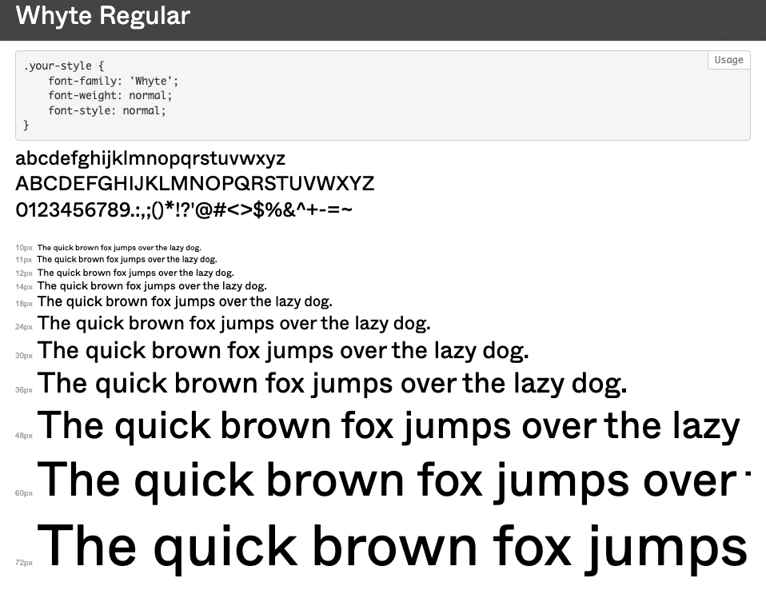
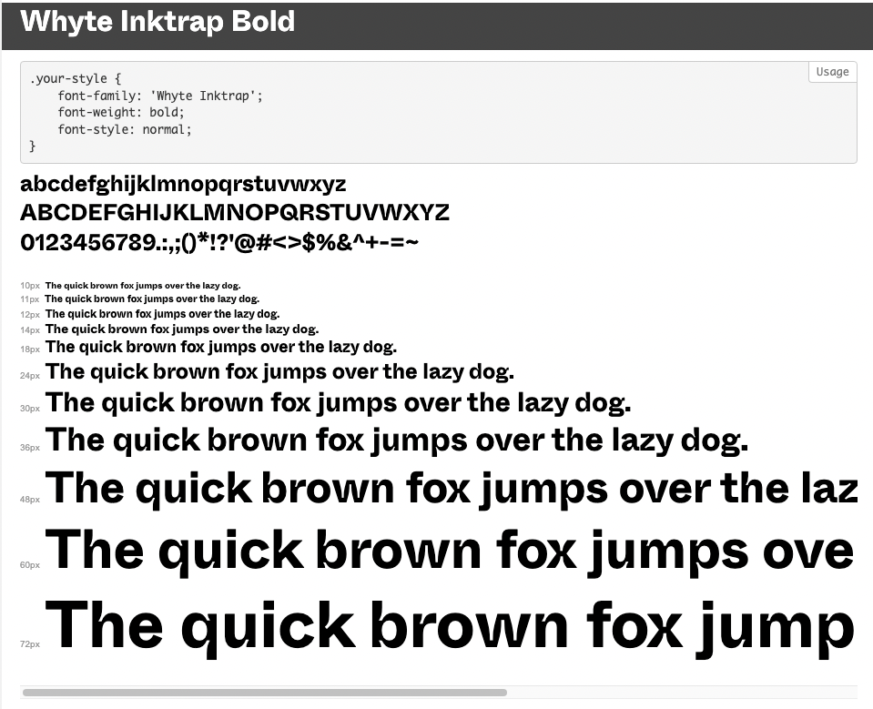

# Figma Merch Store challenge | Frontend Practice

<!-- A brief description of the project. -->

This is a solution to the [Figma Merch Store](https://www.frontendpractice.com/projects/figma) challenge on [Frontend Practice](https://www.frontendpractice.com/).  
# Challenge

Code a pixel perfect replication of the [Figma Merch Store](https://store.figma.com/) site created by 
## Demo
View live demo <s>[here](https://inquisitive-strudel-fa01fb.netlify.app/)</s>

## Screenshots
<!-- Insert a few screenshots of the project, showcasing its functionality and design. -->

## Technologies Used
<!-- List the programming languages, frameworks, libraries, and any other tools or technologies used in the project. -->

## Features
<!-- List the main features of the project, with brief descriptions of each. -->

<b>Custom fonts</b>
 
uses custom fonts <i>["Whyte"]('https://www.typewolf.com/whyte')</i>, and <i>"Whyte Inktrap"</i> which features deep ink traps in the joints of letters.  

#### Whyte for bodytext

#### Whyte Inktrap Bold for the display text

<b>Dropdown search bar</b>
 

<!-- TO-DO => (style) /HOME  dropdown mobile menu  -->

- [x] dropdown search bar when the icon is clicked.

<!-- TO-DO =>  (animations) HERO/HEADER COMPONENT -->

<b>Draggable Slider using GSAP</b>
 

created a draggable slider for the featured images shown in the hero component using [GreenSock Animations](https://greensock.com/)

- [ ] Draggable slider 
<!-- How to Create a Draggable slider-->

<b>
Circle with rotating text and hover animation</b>

 
<!-- TO-DO =>  (animations)  /HOME COMPONENT -->
- [ ] Recreate the circle with rotating text and hover animation.

<!-- TO-DO => (functionality) create custom currency pipe to change product price according to selected region  -->
<!-- TO-DO => (animations) (functionality) Add Chaotic sticker Sprinkle -->
<!-- TO-DO => (styles) organize SVGs -->

<b>
 Change image on hover</b>
 
 

Hover effects - Change image on hover

<!-- TO-DO => (styles) #SHOP COMPONENT -->
<!-- TO-DO => (styles) /ABOUT COMPONENT -->

<b>Content filtering
</b>
 
<!-- TO-DO => (functionality) /SEARCH COMPONENT -->
- [ ] Content filtering
- [ ] Search bar

<b>Shopping Cart:
</b>
 
<!-- TO-DO => (functionality) (styles) /CART COMPONENT Add a shopping cart: Implement a shopping cart feature that allows users to add products to their cart and view their cart on the homepage.-->

<!-- TO-DO => (functionality) (bonus) Implement checkout: Implement a checkout feature that allows users to enter their payment and shipping information and complete their purchase. -->

<b>
 Angular in-memory-web-api (Bonus)</b>
 

<!-- TO-DO => (animations) (functionality)footer ticker tape -->

<b>User Reviews/Ratings (Bonus)</b>

 
<!-- TO-DO => (styles) -->
UI Inspo from [Dribble](https://dribbble.com/shots/21512658-Reviews-and-ratings) 

<b>Size Chart (Bonus)</b>
 <!-- TO-DO => (styles) -->
 

## Installation
<!-- Provide step-by-step instructions on how to download, install, and run the project on a local machine. -->
This project was generated with [Angular CLI](https://github.com/angular/angular-cli) version 15.0.0.

### Development server

Run `ng serve` for a dev server. Navigate to `http://localhost:4200/`. The application will automatically reload if you change any of the source files.

## What I learned

I enjoyed working on this project it was a nice balance of styling requirements and functional requirements great forntend project to practice with.

<!-- Process   -->
### Angular routing
Set up routing: Set up routing so that users can navigate between pages. used `/product/:id` `/product/:name` to route to project page
### Display products
Used Angular's data binding  and router params to display the `/product-list` of `/product-card`'s which route to each `/product` detail pages.  
### Stateless Observable Service using RxJs and Angular Services
created a stateless observable service `product.service.ts` to store as little state as possible on the client and instead fetch the data from the server when needed
- MVC/MVVM architecture
### JSON server to store and retrieve data
<!-- Connect to a backend using JSON serverthat provides data about your products. This can be done using HTTP requests or a service. -->

## Continued development
## Useful resources
<!-- List any external resources or libraries used in the project, as well as any contributors or collaborators. -->
- [Angular Currency Pipe & Format Currency In Angular with examples](https://www.angularjswiki.com/angular/angular-currency-pipe-formatting-currency-in-angular/) - Angular Currency Pipe is one of the bulit in pipe in Angular used to format currency value according to given country code,currency,decimal,locale information.
- [Angular CurrencyPipe](https://angular.io/api/common/CurrencyPipe)
- [Angular in-memory-web-api](https://angular.io/tutorial/tour-of-heroes/toh-pt6)
-  [angular.io](https://angular.io/tutorial/tour-of-heroes/toh-pt2)
- [phosphor icons](https://phosphoricons.com/)
- [Auto-placement in grid layout](https://developer.mozilla.org/en-US/docs/Web/CSS/CSS_grid_layout/Auto-placement_in_grid_layout)
- [:nth-child() pseudo-class](https://www.w3.org/TR/selectors/#nth-child-pseudo)
- [CSS Grid Generator](https://cssgrid-generator.netlify.app/)
- [Udemy: Reactive Angular Course (with RxJs, Angular 16) by Angular University](https://www.udemy.com/course/rxjs-reactive-angular-course) - Build Angular 16 Applications in Reactive style with plain RxJs - Patterns, Anti-Patterns, Lightweight State Management
## Author

- Website - [Chanda Abdul](https://www.Chandabdul.dev)
- GitHub - [github.com/Chanda-Abdul](https://github.com/Chanda-Abdul)

